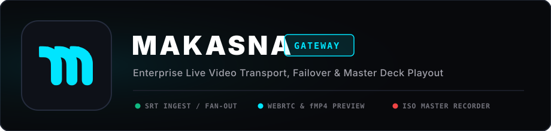

<p align="center">
  
</p>

# Panduan Operasional Makasna Broadcast Gateway

Dokumen ini merupakan panduan teknis operasional resmi untuk **Makasna Live Video Transport Gateway**, mencakup konfigurasi encoder lapangan, penerimaan di studio siaran, failover redundan, perekaman ISO mandiri, sinkronisasi Google Drive, serta pengoperasian aplikasi remote controller Android.

---

## Daftar Isi
1. [Arsitektur & Konsep Alur Siaran](#1-arsitektur--konsep-alur-siaran)
2. [Panduan Pengirim Lapangan (Ingest Encoder)](#2-panduan-pengirim-lapangan-ingest-encoder)
3. [Panduan Penerima Studio (Downstream Playout / Client)](#3-panduan-penerima-studio-downstream-playout--client)
4. [Manajemen Rute Siaran & Failover Redundan](#4-manajemen-rute-siaran--failover-redundan)
5. [Konsol Perekaman Master Deck & Arsip Cloud](#5-konsol-perekaman-master-deck--arsip-cloud)
6. [Monitoring Audio & Deteksi Digital Clipping](#6-monitoring-audio--deteksi-digital-clipping)
7. [Pengoperasian Aplikasi Remote Android](#7-pengoperasian-aplikasi-remote-android)
8. [Daftar Port Jaringan & Troubleshooting](#8-daftar-port-jaringan--troubleshooting)

---

## 1. Arsitektur & Konsep Alur Siaran

Makasna Gateway bertindak sebagai jembatan transport video siaran dengan keandalan tinggi (*mission-critical video transport*).

* **Alur Sinyal:**
  1. **Ingest (Kontribusi Lapangan):** Encoder lapangan mengirim sinyal melalui protokol SRT (Caller) ke IP Server port `8890` dengan format `publish:NAMA_STREAM`.
  2. **Core Server (MediaMTX & Gateway Supervised Engine):** Server menerima feed, menganalisis telemetri real-time (bitrate, loss, RTT), mendistribusikan ke rute aktif, serta memfasilitasi live preview fMP4/WebRTC.
  3. **Egress (Distribusi / Fan-out):** Sinyal diteruskan ke software studio siaran (vMix / OBS) melalui SRT Caller atau SRT Listener, serta dapat difan-out ke RTMP (YouTube Live, Facebook) secara simultan tanpa overhead CPU.
  4. **Master Recording:** Engine perekam ISO bekerja mandiri merekam file master MOV atau MP4 dalam segmen 15/30/60 menit dan otomatis mengunggahnya ke Google Drive.

---

## 2. Panduan Pengirim Lapangan (Ingest Encoder)

Kamera lapangan atau laptop encoder produksi mengirim video ke server menggunakan protokol **SRT Caller**.

### A. Pengaturan di OBS Studio
1. Buka **Settings** > **Stream**.
2. Pilih **Service**: `Custom...`
3. Masukkan **Server**:
   ```
   srt://IP_SERVER:8890?streamid=publish:NAMA_STREAM&latency=2000000
   ```
   *(Ganti `IP_SERVER` dengan IP server gateway dan `NAMA_STREAM` dengan kode feed kamera, misal: `CAM1` atau `PROGRAM`)*.
4. Kosongkan kolom **Stream Key**.
5. Klik **Apply** dan mulai siaran (**Start Streaming**).

### B. Pengaturan di vMix
1. Buka tombol gerigi (Settings) pada **External / Stream**.
2. Pilih Destination: `SRT`.
3. Atur parameter:
   * **Type:** `Caller`
   * **Hostname:** `IP_SERVER`
   * **Port:** `8890`
   * **Latency:** `2000` ms (atau sesuai kondisi jaringan seluler lapangan)
   * **Stream ID:** `publish:NAMA_STREAM`
4. Klik **Start**.

### C. Standar Konfigurasi Encoder Video
Untuk stabilitas transmisi SRT melalui jaringan publik/seluler:
* **Codec Video:** H.264 atau H.265 (HEVC 8-bit Main Profile).
* **Keyframe GOP:** 1 detik atau 2 detik (*Strict Closed GOP*, jangan gunakan Auto).
* **B-Frames:** 0 (*Zero Latency Mode*).
* **Rate Control:** CBR (*Constant Bitrate*).
* **Codec Audio:** AAC Stereo, 48.000 Hz, Bitrate 128 kbps s/d 192 kbps.

---

## 3. Panduan Penerima Studio (Downstream Playout / Client)

Tim studio menarik (*pull/listen*) feed siaran dari server ke PC switcher atau laptop monitoring.

### A. Menerima di vMix Studio
1. Klik **Add Input** di kiri bawah vMix.
2. Pilih tab **Stream / SRT**.
3. Pilih **Type:** `Caller`.
4. Masukkan parameter:
   * **Hostname:** `IP_SERVER`
   * **Port:** `8890`
   * **Latency:** `2000` ms
   * **Stream ID:** `read:NAMA_STREAM` *(Penting: jangan sertakan awalan "streamid=")*.
5. Klik **OK**. Feed akan langsung tayang stabil dengan latensi rendah.

### B. Menerima di VLC Media Player
1. Buka VLC > Menu **Media** > **Open Network Stream** (Ctrl + N).
2. Masukkan URL:
   ```
   srt://IP_SERVER:8890?streamid=read:NAMA_STREAM
   ```
3. Klik **Play**.

### C. Membuka Live Preview di Browser
* **HLS Preview:** `http://IP_SERVER:8080/hls/NAMA_STREAM/index.m3u8`
* **WebRTC Ultra-Low Latency:** `http://IP_SERVER:8889/NAMA_STREAM/`

---

## 4. Manajemen Rute Siaran & Failover Redundan

Makasna Gateway mendukung pembuatan rute siaran dinamis dengan perlindungan failover:

1. **Primary Source (Sumber Utama):**
   * Pilihan mode: *Live Inbound SRT* (feed yang sedang masuk), *SRT Listener* (port khusus), atau *SRT Caller* (menarik stream remote).
2. **Secondary Source (Failover / Cadangan):**
   * Sinyal cadangan dari jalur internet atau pemancar berbeda.
   * Jika sinyal utama terputus, gateway secara otomatis beralih ke sinyal sekunder tanpa memutus transmisi ke pemirsa.
3. **Multi-Destination Fan-Out:**
   * Satu sumber input dapat didistribusikan ke banyak tujuan sekaligus (SRT studio, RTMP YouTube, broadcast playout).
   * Mode **Passthrough (Copy)** berjalan dengan 0% beban CPU karena stream disalin langsung bit-ke-bit.
   * Jika audio feed berupa MP2/AC3, sistem secara otomatis melakukan transcode audio ke AAC agar ramah platform RTMP/YouTube tanpa merusak stream video.

---

## 5. Konsol Perekaman Master Deck & Arsip Cloud

Perekaman ISO master berjalan secara mandiri tanpa membebani atau mengganggu transmisi siaran utama.

1. **Pemilihan Feed:** Pilih kamera yang ingin direkam melalui dropdown *Feed Source*.
2. **Format Kontainer:**
   * **MP4 Universal:** Standar web dan arsip kompatibel universal.
   * **QuickTime MOV:** Dilengkapi header `+faststart` untuk kebutuhan editing langsung pada software NLE broadcast (DaVinci Resolve, Final Cut Pro, Adobe Premiere Pro).
3. **Kontrol Bitrate & Resolusi:**
   * Pilihan bitrate: Passthrough (asli tanpa kompresi ulang), 2.5 Mbps, 4.5 Mbps, 6.0 Mbps, 8.0 Mbps, 12.0 Mbps, atau Custom kbps.
   * Pilihan resolusi: Source Asli, 1080p Full HD, atau 720p HD.
4. **Durasi Segmen:** 15 Menit, 30 Menit, atau 1 Jam per file.
5. **Penghentian Bersih:** Tombol **STOP** mengirimkan sinyal SIGINT ke FFmpeg sehingga seluruh metadata dan header atom MP4/MOV tertutup sempurna tanpa merusak file rekaman.
6. **Sinkronisasi Google Drive:**
   * Segmen file yang selesai ditulis otomatis dimasukkan ke antrean upload latar belakang.
   * Menggunakan chunk 16 MB dengan mekanisme *resumable upload* dan deteksi file lock Linux agar file yang sedang ditulis tidak terunggah secara prematur.

---

## 6. Monitoring Audio & Deteksi Digital Clipping

Untuk menjamin kualitas siaran bebas dari distorsi audio:
1. **Meteran VU Real-Time:** Tersedia pada Web Dashboard dan Remote App dengan ballistics dynamic peak-hold.
2. **Skala Meter:**
   * **dBFS:** -60 dBFS hingga 0 dBFS (standar digital).
   * **dBVU:** -20 dBVU hingga +3 dBVU (referensi siaran: 0 dBVU = -18 dBFS).
3. **Indikator DIGITAL CLIP!:**
   * Jika sinyal mic/mixer menyentuh batas merah overload (0 dBFS), lampu peringatan merah **DIGITAL CLIP!** akan menyala instan.
   * Petugas audio harus segera menurunkan (*trim*) gain mixer lapangan.

---

## 7. Pengoperasian Aplikasi Remote Android

Aplikasi Android mandiri (*Makasna Remote*) memungkinkan operator dan kru lapangan mengontrol seluruh fungsi server dari smartphone:

* **Repositori Aplikasi Mobile Mandiri:** [justrangga/makasna-remote-controller](https://github.com/justrangga/makasna-remote-controller)
* **Download Aplikasi Langsung:** Unduh file APK langsung dari server di `http://IP_SERVER:8080/download/apk` atau via GitHub Releases di repositori aplikasi remote.
* **Koneksi Dinamis:** Masukkan IP server, Port HTTP (8080), dan Port SRT (8890). Aktifkan toggle *Remember Login Session* agar aplikasi langsung tersambung otomatis saat dibuka berikutnya.
* **Tab Signal:** Memantau throughput bandwidth masuk/keluar, encoder yang terhubung, dan membuat rute siaran langsung dari feed aktif.
* **Tab Recorder:** Memantau video preview, memulai dan menghentikan rekaman master ISO, serta mengatur format dan bitrate.
* **Tab Routes:** Mengaktifkan, mematikan, membuat, dan mengedit rute fan-out siaran.

---

## 8. Daftar Port Jaringan & Troubleshooting

| Port | Protokol | Layanan | Deskripsi |
|:---:|:---:|:---|:---|
| **8080** | TCP | Flask Web Dashboard | Antarmuka web, API remote, dan reverse proxy HLS |
| **8890** | UDP | MediaMTX SRT Server | Port utama ingest publisher dan tarikan listener SRT |
| **1935** | TCP | MediaMTX RTMP Server | Port ingest RTMP alternatif |
| **8554** | TCP | MediaMTX RTSP Server | Port RTSP server internal |
| **8888** | TCP | MediaMTX HLS Server | Engine pemutar fMP4 internal |
| **8889** | TCP | WebRTC Signaler | Pemutar WebRTC latensi rendah di browser |
| **12100–12150**| UDP | Dynamic Route Ports | Port SRT listener untuk rute redundan |

### Troubleshooting Umum:
* **Video Blank / Buffering:** Pastikan encoder lapangan menggunakan *Strict Closed GOP* (1-2 detik) dan B-Frames = 0.
* **Gagal Konek ke Server:** Periksa apakah firewall cloud/hosting mengizinkan port UDP 8890 dan port TCP 8080.
* **Audio Pecah:** Periksa indikator True Peak VU Meter. Jika menyala merah, turunkan master gain pada mixer audio sebelum masuk ke encoder.

---

*Hak Cipta © Makasna Broadcast Infrastructure. Seluruh hak cipta dilindungi undang-undang.*
