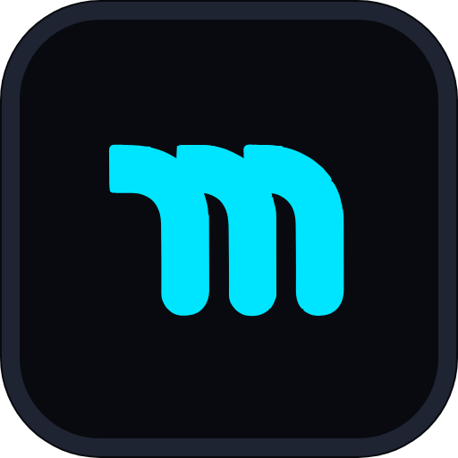

# MAKASNA Mobile Remote Broadcast Controller (Android)

<p align="center">
  
</p>

<p align="center">
  <b>Aplikasi Android Remote Controller &amp; Signal Monitor untuk Makasna Live Video Transport Gateway</b><br>
  <i>Kendalikan perekaman HyperDeck, pantau sinyal SRT lapangan, cek audio clipping, dan atur rute siaran langsung dari smartphone tanpa perlu membuka laptop.</i>
</p>

---

## 📱 Fitur Utama

1. **Konfigurasi Server Dinamis (Ganti IP & Port Kapan Saja):**
   * Masukkan IP publik server (default: `139.190.97.109`), port HTTP API (`8080`), dan port SRT (`8890`).
   * Tombol **"Uji Koneksi Server"** (Handshake Ping) untuk memvalidasi reachability dan otentikasi sebelum masuk ke kontrol siaran.
   * Kredensial dan endpoint otomatis tersimpan aman di penyimpanan lokal smartphone (*SharedPreferences*).

2. **Signal & Ingest Monitor (Cek Sinyal Masuk & Keluar):**
   * **Ingest Throughput:** Bitrate masuk kamera lapangan (`↓ X.XX Mbps`), packet loss %, dan RTT latency.
   * **Ingest Publishers:** Daftar feed encoder/kamera yang sedang aktif mengirimkan stream (`publish:STREAM_NAME`).
   * **Active Listeners:** Daftar PC penerima downstream (seperti PC Blackgate / vMix / VLC) yang sedang me-listen feed (`read:STREAM_NAME`) lengkap dengan IP, Port, dan megabyte data yang telah ditransmisikan.

3. **HyperDeck Master ISO Recorder Remote:**
   * **Master Tally Lamp:** Indikator tally hardware broadcast menyala berkedip merah terang saat merekam `[● REC ACTIVE]` dan biru/abu-abu saat `[■ STANDBY]`.
   * **OSD LCD Timecode:** Jam waktu monospace real-time `00:14:32:00` dan label feed aktif.
   * **Kontrol Rekam:** Tombol besar taktil **RECORD** (merah) dan **STOP** (dengan dialog konfirmasi keselamatan untuk mencegah salah tekan).
   * **Container & Durasi:** Pilihan format universal MP4 vs Apple QuickTime MOV, serta durasi segmen (15m, 30m, 1h, Single File).

4. **Audio True Peak VU Meter & Deteksi Audio Pecah (Digital Clipping):**
   * Visualisasi VU meter stereo CH1 & CH2 (Left / Right).
   * Indikator peringatan merah **`PECAH! (CLIP)`** ketika audio menyentuh ambang batas distorsi digital ($0\text{ dBFS}$).

5. **Routes Workspace & Failover Switcher:**
   * Mulai dan hentikan rute siaran secara instan.
   * Lakukan failover manual dari sumber primer ke sumber sekunder (cadangan) dengan 1 klik.

---

## 🛠️ Persyaratan Sistem & Kompilasi

* **Flutter SDK:** Version `>= 3.0.0`
* **Android Studio:** Hedgehog / Iguana / Jellyfish (atau versi lebih baru)
* **Android SDK:** API Level 24+ (Android 7.0 Nougat s/d Android 14+)

---

## 🚀 Panduan Membuka & Menjalankan di Android Studio

1. **Buka Project:**
   * Buka **Android Studio**.
   * Pilih menu **Open** dan arahkan ke folder `mobile-app` di dalam repositori ini.
2. **Ambil Dependencies (Pub Get):**
   * Di terminal Android Studio, jalankan:
     ```bash
     flutter pub get
     ```
3. **Hubungkan Smartphone Android:**
   * Aktifkan **USB Debugging** pada menu Developer Options di smartphone Anda.
   * Pilih device smartphone di dropdown Android Studio.
4. **Jalankan Aplikasi:**
   * Tekan tombol hijau **Run** (Shift + F10) atau jalankan melalui terminal:
     ```bash
     flutter run
     ```

---

## 📦 Cara Membangun File APK (Release Build)

Untuk menghasilkan file installer `.apk` mandiri yang siap diinstall langsung ke semua smartphone tim lapangan:

```bash
cd mobile-app
flutter build apk --release
```

File APK siap pakai akan otomatis terbentuk di direktori:
```text
mobile-app/build/app/outputs/flutter-apk/app-release.apk
```

Kirimkan file `app-release.apk` tersebut ke smartphone Android melalui WhatsApp, Telegram, Google Drive, atau via perintah ADB:
```bash
adb install -r build/app/outputs/flutter-apk/app-release.apk
```

---

## ⚙️ Konfigurasi Awal di Smartphone

1. Setelah aplikasi terpasang di HP, buka aplikasi **Makasna Remote**.
2. Masuk ke tab **Settings** (ikon slider di navigasi bawah).
3. Masukkan konfigurasi gateway:
   * **SERVER IP:** `139.190.97.109` *(atau IP server baru Anda)*
   * **API PORT:** `8080`
   * **SRT PORT:** `8890`
   * **USERNAME:** `admin`
   * **PASSWORD:** `[PASSWORD DASHBOARD ANDA]`
4. Tekan tombol **"UJI KONEKSI SERVER"**. Jika muncul notifikasi hijau *"Koneksi Sukses"*, tekan tombol **"SIMPAN & TERAPKAN PROFILE"**.
5. Seluruh telemetri sinyal, rute, dan konsol HyperDeck akan otomatis aktif dan tersinkronisasi secara real-time setiap 2 detik.
